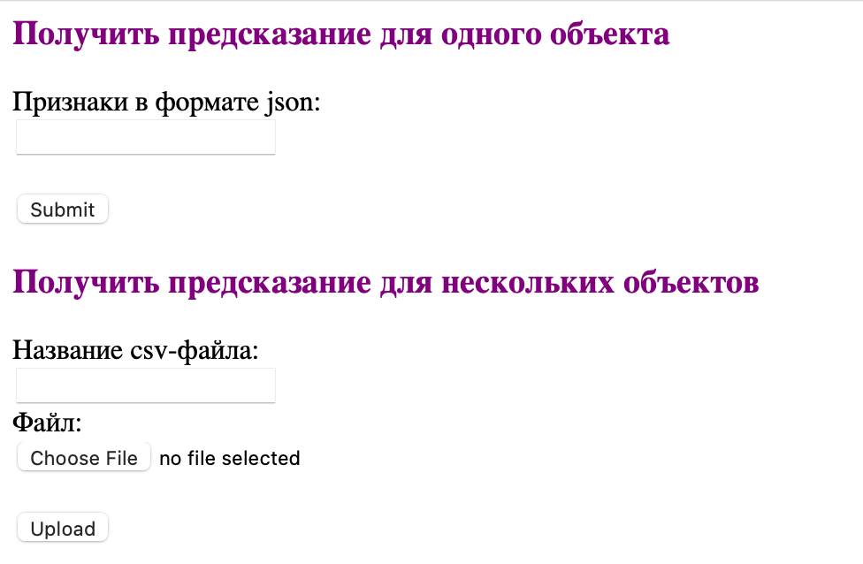
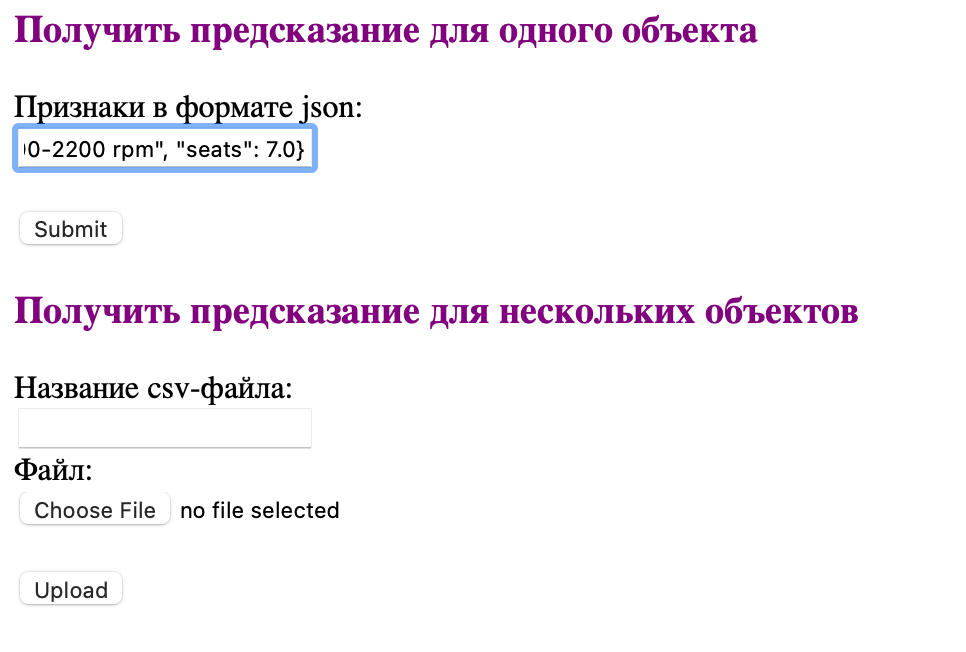
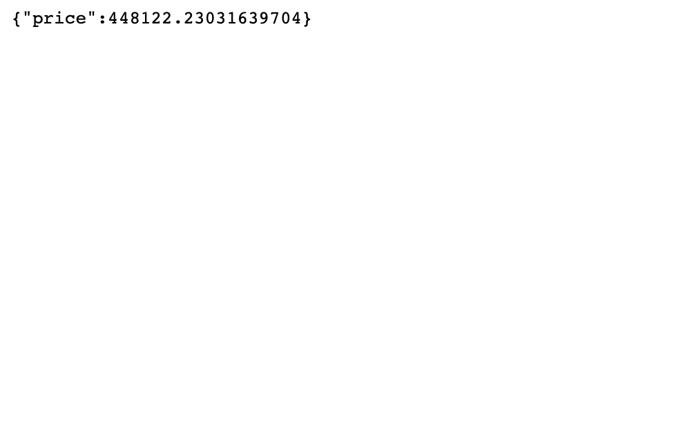
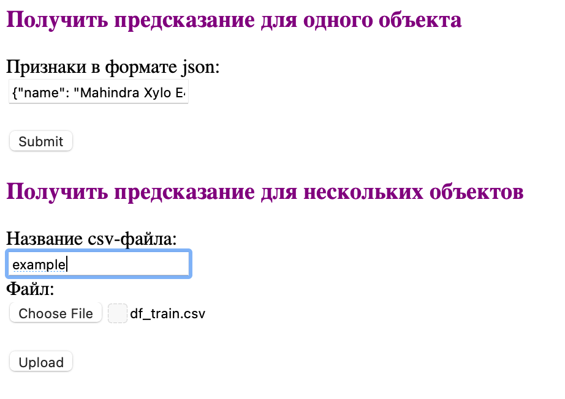

Домашнее задание 1

# Основные части домашнего задания: 
- Обработка датасета
- EDA
- Построение и сравнение моделей
- Проработка новых признаков и попытки улучшить качество модели
- Реализация сервиса с использованием FastApi

## Обработка датасета
1. Были обработаны пропуски (заполнены медианой)
2. Отобраны фичи (базово, по заданию) 
3. Стандартизированы вещественные фичи + категориальные фичи пропущены через OneHotEncoder

Тут никакой фантазии, все чисто по заданию 

## EDA
Построила графика, где сравнила фичи друг с другом, их связь, а так же наличие корреляции между ними.
Те фичи, которые больше всего коррелировали друг с другом потом были отсеяны.

Доп. выводы и графики можно посмотреть в самом ноутбуке

## Построение и сравнение моделей
Были построены следующие модели: 
1. LinearRegression на вещественных нестандартизированных признаках: R2 = 0.5941
2. LinearRegression на вещественных стандартизированных признаках: R2 = 0.5941
3. Lasso на вещественных признаках для определения самых важных
4. Ridge на вещественных и категориальных признаках: R2 = 0.6663
5. ElasticNet на вещественных признаках: R2 = 0.6758
6. LinearRegression на всех признаках + новые признаки: 0.8264

### Описание новых признаков

- Добавила квадраты year, mileage и max_power
- Добавила кол-во владельцев
- Добавила модель автомобиля

## Реализация сервиса с использованием FastApi
Вот так выглядит сам интерфейс. Делится он на две части - предсказание для одного объекта и предсказание для многих.  

  

Первая часть принимает на вход json-объект.  
Вот пример, того, какой объект на вход можно подать:  
```
{"name": "Mahindra Xylo E4 BS IV", "year": 2010, "selling_price": 229999, "km_driven": 168000, "fuel": "Diesel", "seller_type": "Individual", "transmission": "Manual", "owner": "First Owner", "mileage": "14.0 kmpl", "engine": "2498 CC", "max_power": "112 bhp", "torque": "260 Nm at 1800-2200 rpm", "seats": 7.0}
```
Пример загрузки объекта:  


Пример ответа:  


Для нескольких объектов пришлось немного запариться. Если нажать кнопку "Upload", то после получения предсказания, итоговый файл автоматически будет скачан.  



# Выводы
- Наибольший буст при построении моделей дало добавление квадратичных признаков, кол-ва владельцев и название модели. Качество сильно улучшилось. 
- Не получилось реализовать интересный интерфейс, через который можно было бы получать предсказания. Текущий выглядит некрасиво(

